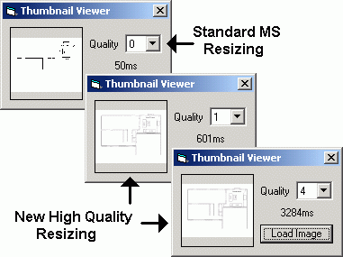



## High Quality Thumbnail Viewer

### Description

Many people have created thumbnail viewers what are quick and dirty, but these do not work well for things like blueprints and similar things. I have created a simple module with an example of how to use it that corrects this problem. I've also added levels of quality to help improve the speed.
 
### More Info
 
ViewImage(strFilename, picTemp, picThumb, intQuality)

             |
---                |---
**Submitted On**   |2002-08-19 15:31:56
**By**             |[Ben White](https://github.com/Planet-Source-Code/PSCIndex/blob/master/ByAuthor/ben-white.md)
**Level**          |Intermediate
**User Rating**    |4.6 (23 globes from 5 users)
**Compatibility**  |VB 6\.0
**Category**       |[Graphics](https://github.com/Planet-Source-Code/PSCIndex/blob/master/ByCategory/graphics__1-46.md)
**World**          |[Visual Basic](https://github.com/Planet-Source-Code/PSCIndex/blob/master/ByWorld/visual-basic.md)
**Archive File**   |[High\_Quali12005681920\.zip](https://github.com/Planet-Source-Code/ben-white-high-quality-thumbnail-viewer__1-37739/archive/master.zip)

